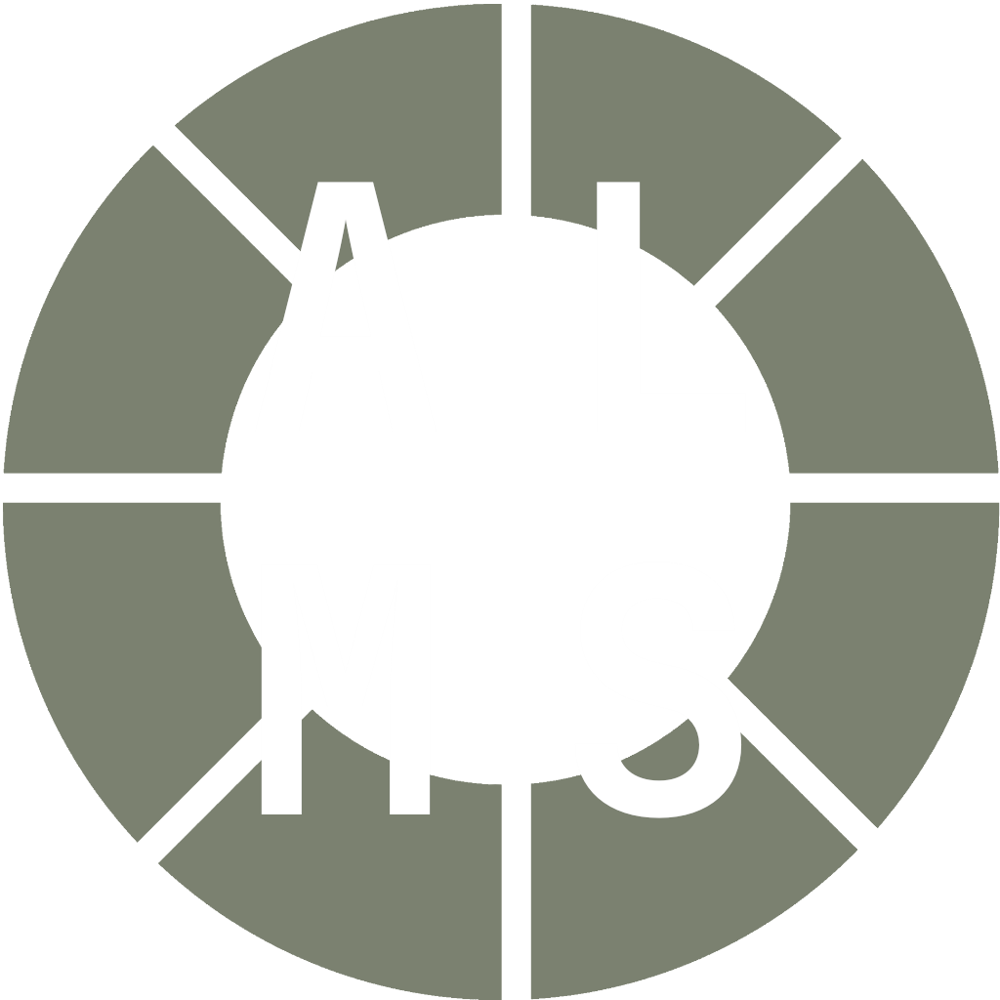

# ALMS

> *Remember: Communication is the future, and the future starts with you.*

The **Aperture Laboratories Messaging Service (ALMS)** is a backend NodeJS REST API server for handling internal communication in Aperture Science, a fictional research facility from Valve's shared Portal and Half-Life universe.

For an example of a client, check out [**Aperture Messenger**](https://github.com/oschl-git/aperture-messenger). Aperture Messenger is a CLI client, but you're welcome to write your own, as ALMS endpoints are well documented and everything is open-source. If you're interested in doing so, check out [the documentation]().

## Features
- sending direct messages ✉️
- creating and communicating in group conversations 📪
- creating new user accounts 👩‍🦰
- password hashing 🔒
- message encryption 🔒
- HTTPS 🔒
- rate limiting ⏱

More features, such as group administrator functionality,  might be added in the future.

## Requirements
- **NodeJS v20.10.0** or compatible
- **MySQL 8.0.36** or compatible

### NPM packages:
- **dotenv** ^16.4.4
- **express** ^4.18.2
- **express-rate-limit** ^7.1.5
- **https** ^1.0.0
- **mysql2** ^3.9.1
- **require-dir** ^1.2.0

## Hosting an ALMS instance
Before starting, make sure to have **NodeJS v20.10.0** and **MySQL 8.0.36** or compatible installed and running. Then follow these steps:

1) Clone this Git repository.
2) Run `npm install` in the project folder to install package dependencies.
3) Use one of the provided SQL scripts to create a MySQL database. You can find them in the [mysql folder](./mysql). One of them creates a database called `ALMS` for you, the other only creates tables and triggers, so you can create your database manually according to your needs.
4) In the project folder, create a `.env` file and fill it with your configuration. To learn how to configure ALMS, check out the [configuration section in the documentation](). Make sure to correctly supply the login details to the database you just created.
5) Run `node .` or `npm run start` in the project folder to start ALMS.

If you're hosting a permanent instance on a server with the **systemd** init system (most Linux distributions), it's a good idea to setup ALMS as a [systemd service](https://www.freedesktop.org/software/systemd/man/latest/systemd.service.html).

## Project information
ALMS, as well as Aperture Messenger, are my final projects for the subject PV at the Secondary Technical School of Electrical Engineering Ječná in Prague.

## License
ALMS is licensed under the [GNU General Public License v3.0](https://www.gnu.org/licenses/gpl-3.0.en.html).