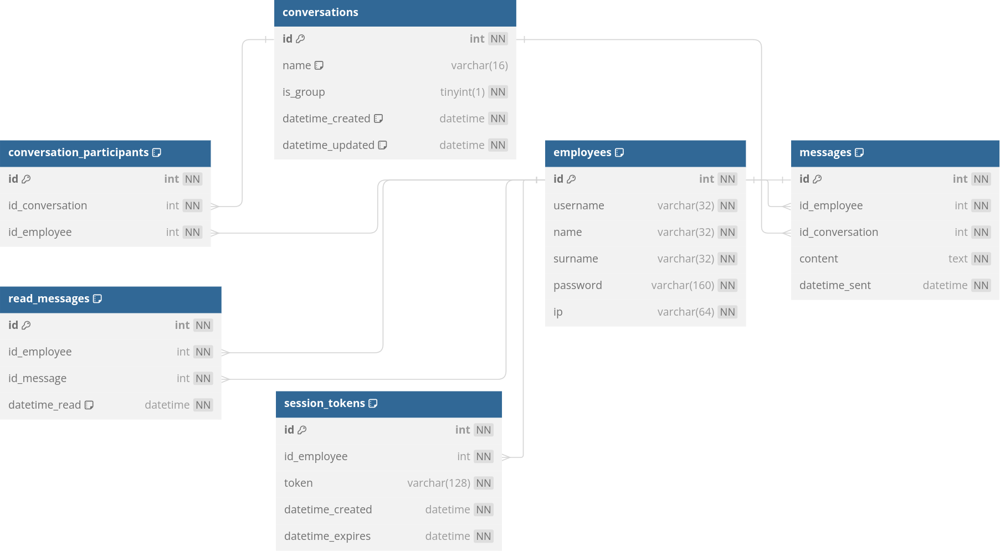

# ALMS DOCUMENTATION
This document attempts to be an exhaustive overview of internal ALMS functionality and an extensive guide for taking advantage of its capabilities.

**API and endpoint documentation is not part of this document. To learn about ALMS API functionality and endpoints specifically, check out the [API & endpoint documentation](API.md).**

- author: **Ondřej Schlaichert**
- created in: **2024**
- made as a final school project for the subject PV at **SPŠE Ječná**
- licensed under the **[GNU General Public License v3.0](https://www.gnu.org/licenses/gpl-3.0.en.html)**

## Used tools and requirements
ALMS is built using JavaScript with **NodeJS**, and utilizes a **MySQL** database for storing user data.
### Requirements:
- **NodeJS v20.10.0** or compatible
- **MySQL 8.0.36** or compatible
#### NPM packages:
- **dotenv** ^16.4.4
- **express** ^4.18.2
- **express-rate-limit** ^7.1.5
- **https** ^1.0.0
- **mysql2** ^3.9.1
- **require-dir** ^1.2.0

### Used tools:
- NodeJS
- NPM
- MySQL
- VSCode
- Adminer
- GIMP
- SoapUI

## Hosting an ALMS instance
### Steps for running ALMS:
Ensure that you have a compatible NodeJS and NPM version installed and that a compatible MySQL database is running.

1) Clone this Git repository.
2) Run `npm install` in the project folder to install package dependencies.
3) Use one of the provided SQL scripts to create a MySQL database. You can find them in the [mysql folder](../mysql). One of them creates a database called `ALMS` for you, the other only creates tables and triggers, so you can create your database manually according to your needs.
4) In the project folder, create a `.env` file and fill it with your configuration. To learn how to configure ALMS, check out the [configuration section](#configuration). Make sure to correctly supply the login details for the database you just created.
5) Run `node .` or `npm run start` in the project folder to start ALMS.

### Running ALMS as a systemd service
On systems using the `systemd` init system (most Linux distributions), it's a good idea to run ALMS as a systemd service. To do this, create a new `.service` file in the `/lib/systemd/system` directory, for example `/lib/systemd/system/alms.service`. Then fill it with the required content, for example:

```
[Unit]
Description=Aperture Laboratories Messaging Service
After=network.target

[Service]
Type=simple
User=user
After=mysql.service
EnvironmentFile=/path/to/alms/directory/.env
ExecStart=/usr/bin/node /path/to/alms/directory
Restart=always

[Install]
WantedBy=multi-user.target
```
Modify this file to suit your needs, reload systemd with `sudo systemctl daemon-reload`, and then start the service with `sudo systemctl start alms` and enable the service with `sudo systemctl enable alms` to always start it on system boot.

## Configuration
ALMS requires a `.env` file to be created in the project directory (not in `src`, but in the root project directory). It should contain the following values:
```
# Logging configuration
LOG_FOLDER="<path to a directory where logs should be stored>"

# Session token configuration
TOKEN_VALID_FOR_MIN=<how long session tokens should be valid for>

# HTTP/HTTPS configuration
PORT=<port ALMS should run on>
USE_HTTPS=<true/false>
HTTPS_CERT="<path to an HTTPS certificate>"
HTTPS_KEY="<path to an HTTPS key>"
MAX_REQUESTS_PER_MINUTE=<maximum amount of requests a single IP can do per minute>

# Message encryption
ENCRYPTION_KEY = "<a 32 byte encryption key>"

# MySQL connection
DB_HOST="<MySQL server address>"
DB_USER="<MySQL user>"
DB_PASSWORD="<MySQL user password>"
DB_NAME="<MySQL database name>"
```
### Example:
```
# Logging configuration
LOG_FOLDER="/home/user/logs/alms"

# Session token configuration
TOKEN_VALID_FOR_MIN=10

# HTTP/HTTPS configuration
PORT=443
USE_HTTPS=true
HTTPS_CERT="/etc/letsencrypt/live/domain/fullchain.pem"
HTTPS_KEY="/etc/letsencrypt/live/domain/privkey.pem"
MAX_REQUESTS_PER_MINUTE=10

# Message encryption
ENCRYPTION_KEY = "ykZVeqavTHTIce8OZohiY1yPEf9E4TqP" # CHANGE THIS!

# MySQL connection
DB_HOST="localhost"
DB_USER="glados"
DB_PASSWORD="averysecurepassword"
DB_NAME="ALMS"
```

## Security

### Aperture Secure Authentication Protocol (ASAP)
ASAP is used for HTTP/HTTPS request authorization. It works in the following steps:

1) The client attempts to log in with a username and password, sending a POST request to the `/login` endpoint.
2) If the supplied details match, ALMS generates a new 128-byte session token and associates it with the provided employee. The token, along with additional user details, are sent in response.
3) The client stores the session token and sends it as header titled `token` with each request. Every request containing the token refreshes its expiry time.
4) If no requests are sent for a time specified in the `.env` file (`TOKEN_VALID_FOR_MIN` option, 10 minutes by default), the token expires and can no longer be used for authorization. The user must log in again.

### Password hashing
Passwords are hashed using the [scrypt](https://en.wikipedia.org/wiki/Scrypt) algorithm. For details on the implementation, examine the code in [`password-hasher.js`](../src/security/password-hasher.js).

### Message encryption
Messages are encrypted using the [AES-256](https://en.wikipedia.org/wiki/Advanced_Encryption_Standard) algorithm. For details on the implementation, examine the code in [`message-encryptor.js`](../src/security/message-encryptor.js).

### HTTPS
ALMS should be hosted and connected to **exclusively** using the secure HTTPS protocol to mitigate password and session token theft; HTTP should only be used for local testing. HTTPS servers should be hosted on port 443. Configuring HTTPS certificates and keys can be done in the `.env` file, as specified in the [configuration section](#configuration) above.

## MySQL database
A MySQL database is used to store user data. It uses the following schema:



**SQL scripts to import the database can be found in the [mysql](../mysql) folder.**

## LOC count
One of the requirements for this project was a minimum line of code count. Below is the output of the [cloc](https://github.com/AlDanial/cloc) program with the `--by-file` option.

```
-------------------------------------------------------------------------------------------------
File                                                          blank        comment           code
-------------------------------------------------------------------------------------------------
src/database/gateways/conversation-gateway.js                    31             10            157
src/database/gateways/employee-gateway.js                        17              3            112
src/endpoints/register.js                                        18             10            101
src/endpoints/add-employee-to-group.js                           13             12             95
src/index.js                                                     15             10             88
src/database/gateways/message-gateway.js                         12              3             81
src/endpoints/create-group-conversation.js                       16             12             76
src/endpoints/send-message.js                                    11             11             69
src/database/gateways/session-token-gateway.js                   14              9             66
src/endpoints/login.js                                           12             11             64
src/helpers/endpoint-handler.js                                   8             10             59
src/security/message-encryptor.js                                15             23             46
src/endpoints/set-employee-color.js                               9              8             45
src/logging/logger.js                                            11             15             41
src/endpoints/get-direct-conversation.js                          9              7             39
src/error_handling/json-validation.js                             5              3             38
src/database/connection.js                                       10             27             37
src/endpoints/get-messages.js                                     8              7             30
src/endpoints/get-unread-messages.js                              8              7             30
src/endpoints/get-conversation-by-id.js                           6              5             24
src/endpoints/index.js                                            5              4             24
src/security/authenticator.js                                     7              8             20
src/helpers/text-file-handler.js                                  5              3             17
src/security/session-token-generator.js                           7              7             17
src/security/password-hasher.js                                   7             14             16
src/error_handling/bad-json.js                                    4              3             15
src/endpoints/is-username-taken.js                                5              4             13
src/endpoints/get-active-employees.js                             4              4             12
src/endpoints/get-all-conversations.js                            4              4             12
src/endpoints/get-all-employees.js                                4              4             12
src/endpoints/get-direct-conversations.js                         4              4             12
src/endpoints/get-group-conversations.js                          4              4             12
src/endpoints/get-unread-conversations.js                         4              5             12
src/error_handling/too-many-requests.js                           3              3             12
-------------------------------------------------------------------------------------------------
SUM:                                                            315            274           1504
-------------------------------------------------------------------------------------------------
```